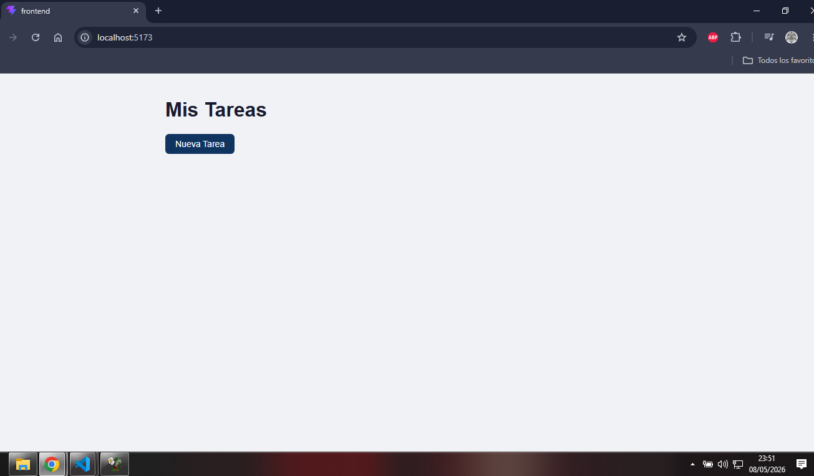
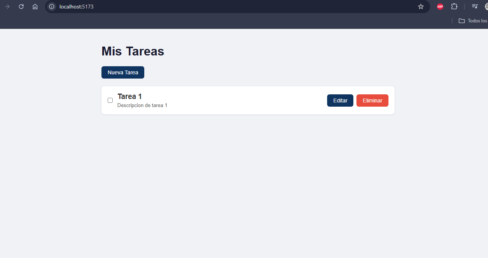
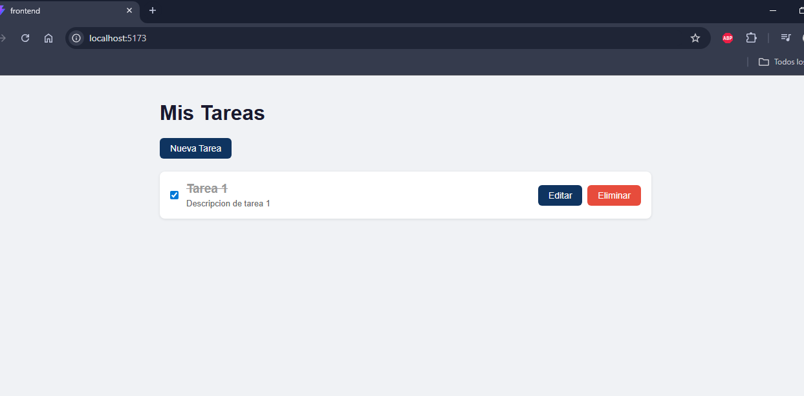
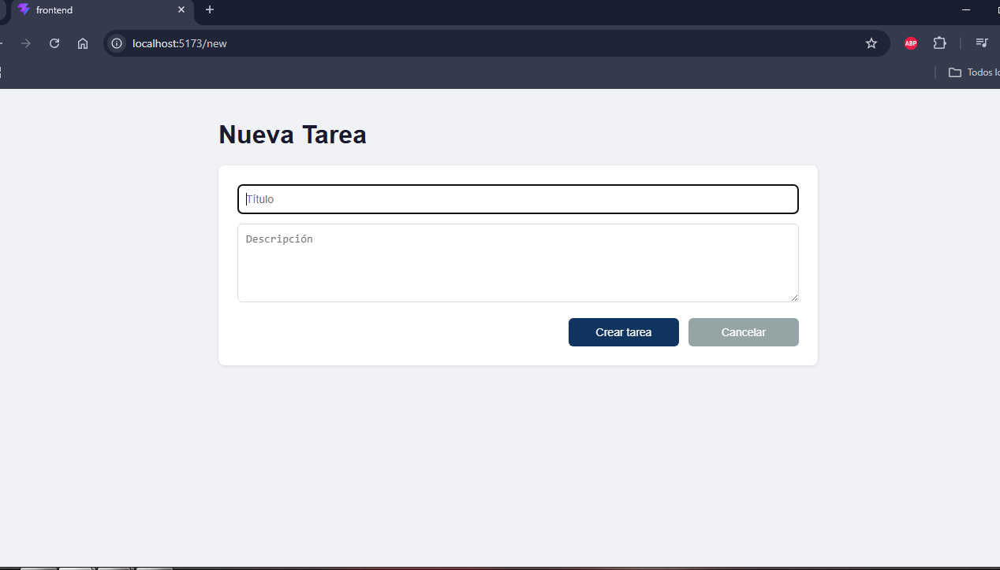
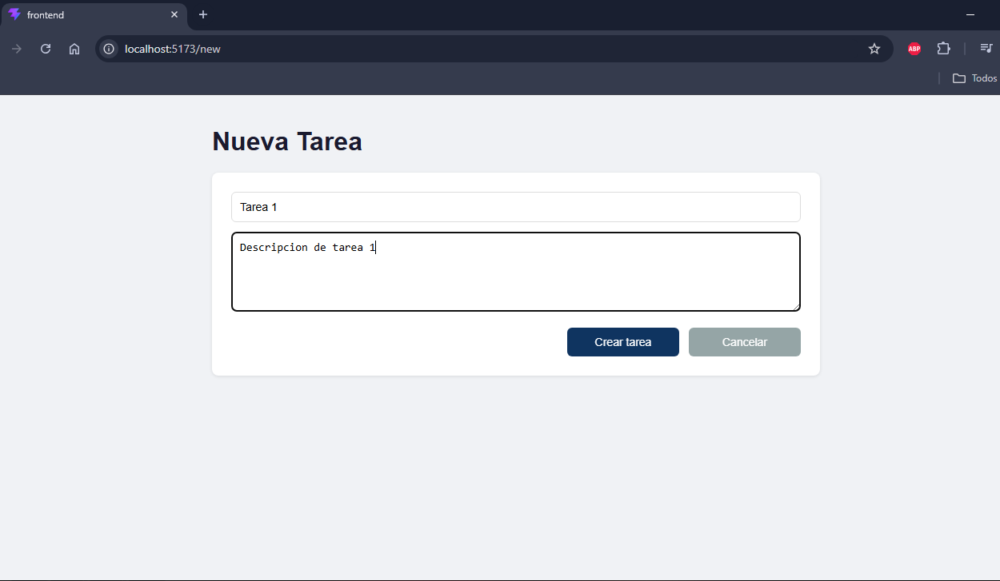

# FernandezM_Challenge_ForIT_2026
Challenge ingreso a Academia ForIT 2026

## Tecnologías utilizadas

**Backend:** Node.js, Express, CORS, dotenv  
**Frontend:** React, Vite, React Router DOM

---

## Estructura del proyecto

```
FernandezM_Challenge_ForIT_2026/
├── backend/
│   └── src/
│       ├── controllers/
│       │   └── tasks.controller.js
│       ├── data/
│       │   └── tasks.js
│       ├── routes/
│       │   └── tasks.routes.js
│       ├── app.js
│       └── server.js
└── frontend/
    └── src/
        ├── components/
        │   ├── TaskForm.jsx
        │   └── TaskItem.jsx
        ├── pages/
        │   └── TaskList.jsx
        ├── services/
        │   └── tasks.service.js
        ├── App.jsx
        ├── main.jsx
        └── index.css
```

---

## Instalación y ejecución local

### Requisitos previos
- Node.js instalado
- Git instalado

### 1. Clonar el repositorio

```bash
git clone https://github.com/Mate-PF/FernandezM_Challenge_ForIT_2026.git
cd FernandezM_Challenge_ForIT_2026
```

### 2. Configurar y ejecutar el backend

```bash
cd backend
npm install
```

Crear el archivo `.env` dentro de `backend/`:

```
PORT=3000
```

Iniciar el servidor:

```bash
npm start
```

El backend queda corriendo en `http://localhost:3000`

### 3. Configurar y ejecutar el frontend

Abrir una nueva terminal:

```bash
cd frontend
npm install
```

Crear el archivo `.env` dentro de `frontend/`:

```
VITE_API_URL=http://localhost:3000/api
```

Iniciar el frontend:

```bash
npm run dev
```

El frontend queda corriendo en `http://localhost:5173`

---

## Endpoints de la API

| Método | Endpoint | Descripción |
|--------|----------|-------------|
| GET | /api/tasks | Obtener todas las tareas |
| POST | /api/tasks | Crear una nueva tarea |
| PUT | /api/tasks/:id | Actualizar una tarea |
| DELETE | /api/tasks/:id | Eliminar una tarea |

---

## Screenshots

### Lista de tareas vacía


### Lista con tareas


### Tarea completada


### Formulario nueva tarea


### Formulario con datos cargados


---

## Autor
Mate-PF